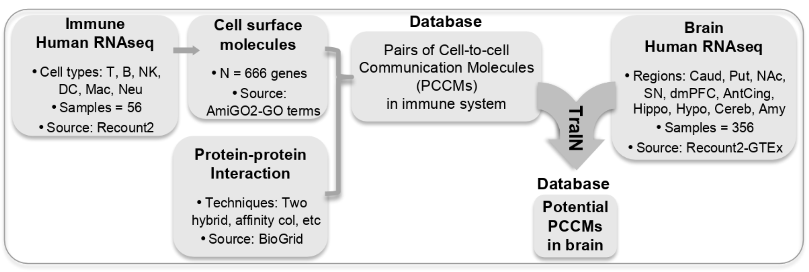

# A TraIN for cell-to-cell communication molecules: Translating from Immunology to Neuroscience

HackSeq19 (Oct 2019) TEAM: Lucia Guerri (lead), David Guo (co-lead), Avi Srivastava, Owen Tsai, Nicole Knoetze, Almas Khan

NCBI Hackathon (May 2019) TEAM: Lucia Guerri (lead), Saba Nafees, Amanda Bell, Jingwen Gu, Van Truong & Miranda Darby 

The TraIN project aims to accelerate gene function knowledge about cell-to-cell communication molecules in the brain by leveraging the knowledge already generated in immunology on those same molecules. In other words, we are looking at the surface molecules used by the immune system cells to communicate with each other, that are also used by neurons to communicate with other neurons and with glial cells in the brain. Better understanding of molecules of cell-to-cell communication and its relation to brain function will help the production of treatment for psychiatric disorders characterized by connectomic abnormalities, such as autism, schizophrenia and addiction.

At a recent NCBI hackathon we generated a hybrid prototype pipeline (with parts in R and parts in Python). Briefly, publicly available RNAseq datasets of purified human immune cells (56 samples from 6 immune cell types) were combined with Protein-Protein Interaction data to identify interacting molecules and define pairs of surface molecules, generating a database of Pairs of Cell-to-cell Communication Molecules (PCCMs); then crossed-referenced against human brain RNAseq datasets (356 samples from 10 brain regions) resulting in over 500 PCCMs with expression in both the brain and the immune system. 

In HackSeq19, we aim to develop a formal and annotated R pipeline, with sanity checks to test for mistakes, and improve certain aspects of it, such as expression cutoffs and stat analysis.

## THIS PROJECT IS CURRENTLY UNDER DEVELOPMENT
