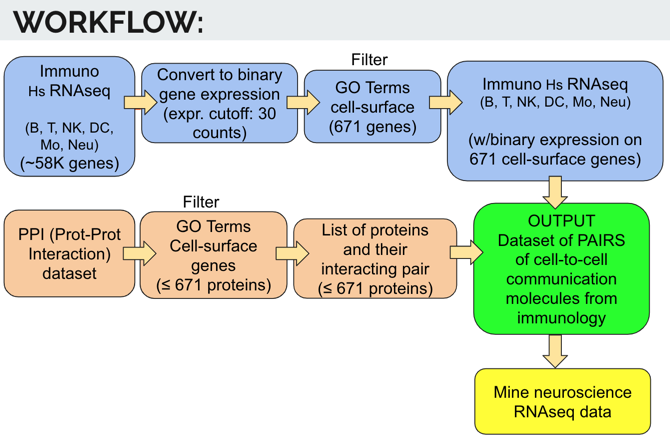

# TraIN: Translating knowledge of cell-to-cell communication molecules from Immunology to Neuroscience with RNAseq data

TEAM: Lucia Guerri, Saba Nafees, Amanda Bell, Jingwen Gu, Van Truong & Miranda Darby 

Dynamic communication between cells is essential for the proper functioning of the human body. While pairs of molecules for cell-to-cell communication usually have an evolutionarily unique functional origin, they are ‘recycled’ and ‘reused’ by different tissues of the body. The study of cell-to-cell communication molecules has been particularly strong in immunology, thanks to the easy isolation of immune cells and the large variety of cell-to-cell interactions. Neuroscience focused mainly on electrophysiological approaches to study the function of the brain, and only recently, started tackling tissue dissociation for purified cell-type and single-cell genomics and molecular studies. I propose to develop a tool to translate knowledge about cell-to-cell communication molecules from immunology into neuroscience. Specifically, we will develop an R tool that uses RNAseq gene expression matrices from pairs of interacting cells (e.g. T-cell/macrophage, T-cell/B-cell, neuron/microglia) and outputs lists of potential pairs of cell-to-cell communication molecules. 

As input, we’ll use a selected subset of publicly available RNAseq datasets of purified cell-types from immune system (in different states of maturation, activation and differentiation) and brain. Gene Ontology terms will be used to filter for plasma-membrane-bound proteins (later versions of the tool will include soluble ligands), and a binomial Y/N system will be used for gene expression. A list of all possible combinations of interaction molecules will be generated for each cell pair. A scoring system will include current knowledge on Protein-Protein Interactions (PPIs, particularly membrane-bound), frequency of each molecule pair across the different cell pairs and "researchability" (druggable targets, temporal and spatial pattern of expression, intracellular signaling, etc). Venn diagrams will be used for visualization of results. Importantly, but time and expertise permitting, we’ll explore the use of single-cell datasets as input for our tool, and machine learning as a partially unsupervised strategy for the identification of cell-to-cell communication molecules in any given gene expression data set. For the latter, the complete pattern of surface molecule gene expression levels will be exploited (ex: adapting WGCNA). By the end of the hackathon, we will have begun to demonstrate that a tool to identify pairs of molecules for cell-to-cell communication (and their conserved intracellular signaling) from immunology can accelerate hypothesis generation in neuroscience. 
